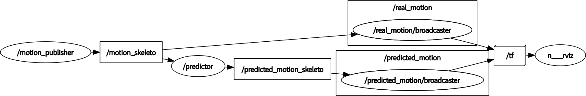

# SRNN Human Motion Prediction for ROS
[En](README.md)|中文

## 概要
本项目完全来源于Ashesh Jain等人的论文，在论文中，作者提出了一种通用方法，用来将高层次的时空结构引入*递归神经网络*（*Recurrent Neural Networks, RNNs*），称之为*结构化递归神经网络*（*Structural-RNN, S-RNN*）。这种方法在处理一些跟时空有关的问题时，效果有显著的提升，如：人类运动建模、人类物体交互、驾驶动机预测等。在本项目中，S-RNN方法被引入到ROS中用于做人类运动预测。

访问S-RNN的项目主页了解详情：[Structural-RNN: Deep Learning on Spatio-Temporal Graphs](http://asheshjain.org/srnn)

## 快速上手
### 依赖
> 建议使用[conda](https://conda.io/docs/)创建虚拟环境，在虚拟环境中安装python依赖。

* ROS (Kinetic Kame on Ubuntu 16.04 or Melodic Morenia on Ubuntu 18.04)
  
  访问[官方安装教程](http://www.ros.org/install)了解如何安装ROS。
* Python (2.7)
* Theano (>=0.6)
* matplotlib
* Neural Models (https://github.com/asheshjain399/NeuralModels)
  
Create an virtual environment named ros_srnn in conda:
```bash
> # 创建conda虚拟环境并安装依赖
> conda create -n ros_srnn python=2.7 Theano matplotlib
> # 激活虚拟环境
> conda activate ros_srnn
> # 安装rosinstall（在conda虚拟环境下需要）
> pip install rosinstall
> # 安装 Neural Models 
> git clone https://github.com/asheshjain399/NeuralModels.git
> cd NeuralModels
> git checkout srnn
> python setup.py develop
```

### 下载数据集与预训练模型

* [H3.6m](http://www.cs.stanford.edu/people/ashesh/h3.6m.zip)
* [pre-trained models](https://drive.google.com/drive/folders/0B7lfjqylzqmMZlI3TUNUUEFQMXc)

> 你可能需要创建一些目录来存放这些文件。
> 
> 在后文中将用**DATASET_PATH**来指代数据集路径。
> 
> 用**CHECKPOINTS_PATH**来指代预训练模型的路径。

### 编译与运行示例程序
* 创建ROS工作空间
  ```bash
  > mkdir -p ros_srnn_ws/src && cd ros_srnn_ws
  > catkin_make
  > source devel/setup.bash
  ```
* 克隆项目代码
  ```bash
  > git clone https://github.com/chenhaowen01/srnn_human_motion_predict_for_ros.git src/srnn_human_motion_predict_for_ros
  ```
* 编译
  ```bash
  > catkin_make
  ```
* 运行
  ```bash
  > # 运行predictor节点，可能需要比较长的时间，请等待模型加载完成。Checkpoint文件路径也可以通过ROS参数checkpoint_path指定。
  > roslaunch srnn_human_motion_predict_for_ros predictor.launch checkpoint_path:=CHECKPOINTS_PATH/srnn_walking/checkpoint.pik
  > # 在predictor节点加载完成之后，运行publisher节点。以下命令可能需要打开一个新的终端窗口来运行。数据集路径也可以通过ROS参数motion_dataset_path指定。
  > roslaunch srnn_human_motion_predict_for_ros motion_publisher.launch motion_dataset_path:=DATASET_PATH/dataset/S7/walking_1.txt
  > # 运行可视化节点查看结果。以下命令可能需要打开一个新的终端窗口来运行。
  > roslaunch srnn_human_motion_predict_for_ros visulize.launch
  ```
  rviz随后会运行起来，里面便可以看到两个运动中的人体骨架。一个是真实的运动，另一个是预测的运动。

## 概述
在项目中，使用了多个ROS节点来完成人类运动的预测。
1. **human_motion_publisher** 节点:
   这个节点读取并解析H3.6m数据集中的人体运动数据，随后将这些数据发布到一个ROS话题**motion_skeleto**中。实际上，这个节点是模仿了一个人体运动捕获系统。可以通过ROS参数**frames_interval**来控制数据发布的速率。
2. **human_motion_predictor** 节点:
   这个节点从话题**motion_skeleto**获得真实的人体运动数据，利用这些数据来预测之后的人体运动，并将结果发布到ROS话题**predicted_motion_skeleto**。预测算法使用结构化递归神经网络（*S-RNN*）（代码来自[RNNexp](https://github.com/asheshjain399/RNNexp)）。可以通过如下ROS参数来控制预测过程：
   * checkpoint_path：预训练模型的路径；
   * prefix_sequence_length：用于预测的真实人体数据的序列长度；
   * predicted_sequence_length：预测数据的序列长度。
3. **motion_tf_broadcaster** 节点:
   这个节点从ROS话题**motion_skeleto**和**predicted_motion_skeleto**订阅数据，转换数据格式然后将真实的、预测的人体运动数据通过tf广播出去，以便随后在rviz中将结果可视化。

这些节点之间的关系可以如下图表示：



## 视频
[](https://youtu.be/fjdQ9AwGgsI)

## FAQ
1. 为什么motion publisher节点以很低的速率发布运动数据？

   受限于硬件，完成一次预测需要很长时间，因此我们只能以较低的速率来发布数据。如果你有足够的计算资源，可以通过修改ROS参数**frames_interval**来使publisher节点运行在一个较高的速率。
2. 我可以使用GPU来加速预测过程吗？

   当然可以，在通过roslaunch运行predictor节点时，可以通过指定命令行参数**device**（默认是cpu）来获得GPU加速。例如：
   ```bash
   > roslaunch srnn_human_motion_predict_for_ros predictor.launch checkpoint_path:=CHECKPOINTS_PATH/srnn_walking/checkpoint.pik device:=cuda0
   ```